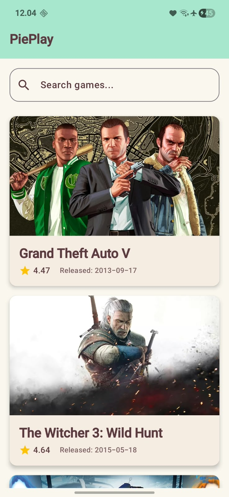
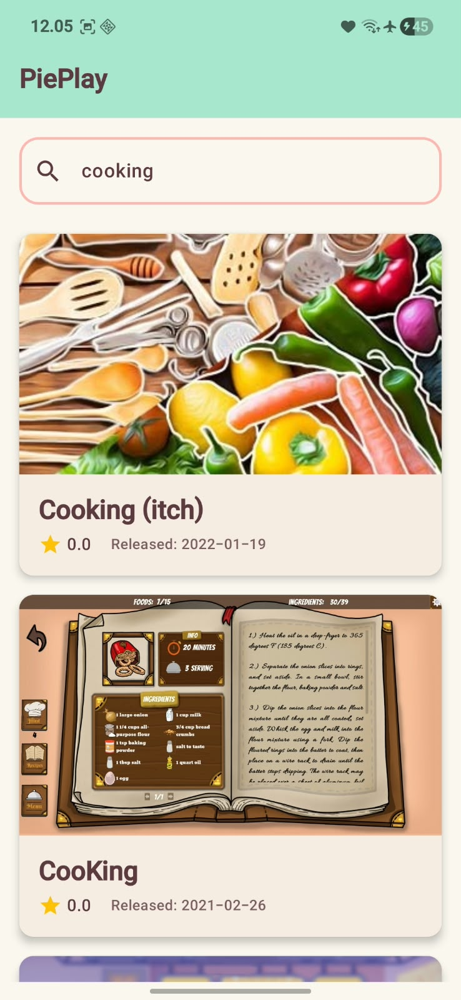
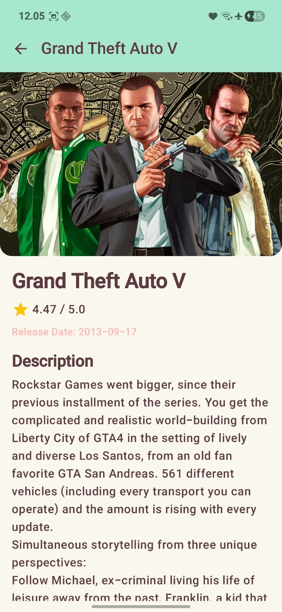

# PiePlay

PiePlay adalah aplikasi katalog game Android modern yang menampilkan daftar game beserta detailnya, menggunakan data langsung dari **RAWG Video Games Database API**.

## Screenshots

| Home Screen | Pencarian (Search) | Detail Screen |
| :---: | :---: | :---: |
|  |  |  |
| *Daftar game yang sedang populer* | *Fitur pencarian game* | *Detail informasi game* |

## Tech Stack & Penjelasan Teknis

Aplikasi ini dibangun menggunakan arsitektur modern Android development:

*   **Bahasa Pemrograman**: [Kotlin](https://kotlinlang.org/) (Bahasa standar dan rekomendasi resmi dari Google untuk Android).
*   **User Interface**: [Jetpack Compose](https://developer.android.com/jetpack/compose)
    *   UI dibangun secara *Declarative* langsung dengan kode Kotlin, meninggalkan sistem XML lama. 
    *   Menggunakan komponen modern dari Material Design 3.
*   **Navigasi**: Navigation Compose
    *   Memungkinkan perpindahan antar layar (`HomeScreen` ke `DetailScreen`) hanya dengan memanggil rute berbentuk string (seperti URL di web) dan mengirimkan parameter (seperti ID Game).
*   **Networking**: [Retrofit](https://square.github.io/retrofit/) & Gson
    *   Retrofit digunakan sebagai *client HTTP* untuk mengambil data dari internet secara asinkron (menggunakan Kotlin Coroutines `suspend`).
    *   Gson digunakan untuk menerjemahkan (mem-*parsing*) format data JSON dari API menjadi bentuk Objek Kotlin (Data Class).
*   **Arsitektur**: MVVM (Model-View-ViewModel)
    *   **Model**: Struktur data (`Game`, `GameResponse`) yang mendefinisikan bentuk data.
    *   **View**: Layar UI (`MainActivity`, `HomeScreen`, `DetailScreen`) yang hanya bertugas menampilkan data ke layar.
    *   **ViewModel**: (`GameViewModel`) Otak aplikasi yang bertugas mengambil data dari API, menyimpannya, dan memberikannya ke View. Ini mencegah data hilang saat layar HP diputar (orientasi berubah).
*   **Izin Akses (Permissions)**:
    *   `android.permission.INTERNET` diaktifkan di dalam `AndroidManifest.xml` agar aplikasi diizinkan mengambil data RAWG API menggunakan internet.

## Cara Menjalankan Project

1. Clone repositori ini.
2. Buka Android Studio dan pilih **File > Open**, lalu arahkan ke folder project ini.
3. Tunggu hingga proses *Gradle Sync* selesai.
4. Buat akun di [RAWG.io](https://rawg.io/apidocs) untuk mendapatkan API Key.
5. Masukkan API Key tersebut ke dalam file kode yang membutuhkan atau di `local.properties` (sesuaikan dengan kodemu).
6. Tekan tombol **Run** (Shift + F10) untuk menjalankan aplikasi di Emulator atau perangkat fisik Android.
